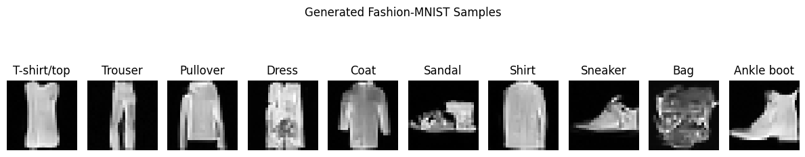
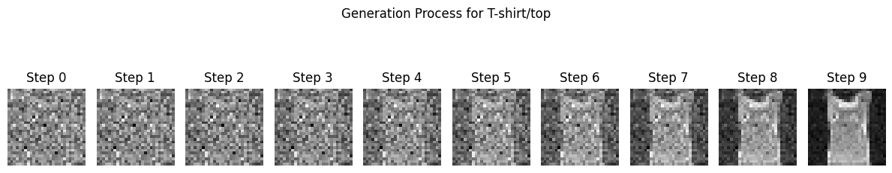

# Understanding Flow-Matching and Diffusion

This repository collects exploratory notebooks that implement modern generative-learning techniques on toy and canonical datasets. Current work includes:

- Conditional rectified-flow experiments on 2D moons and Fashion-MNIST, featuring FiLM-conditioned MLPs and a small convolutional UNet.
- Denoising diffusion models with configurable variance schedules and class conditioning, evaluated through iterative sampling visualizations.
- Utilities for data normalization, visualization, and interactive debugging within the notebooks.

Use the notebooks to compare rectified-flow training against diffusion-style objectives, inspect model behaviour under label conditioning, and visualize sampling trajectories across datasets.
